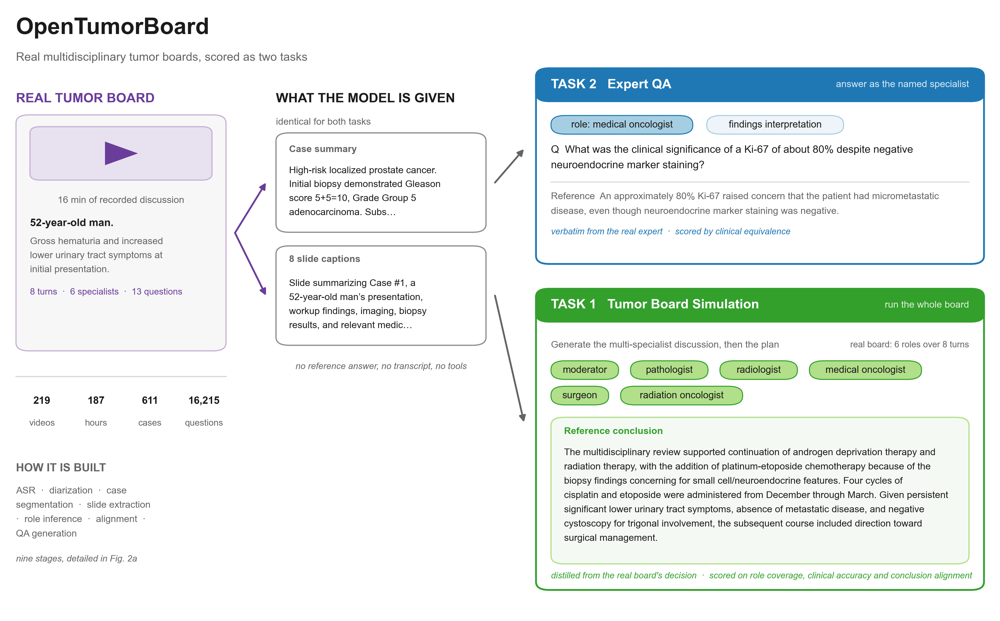
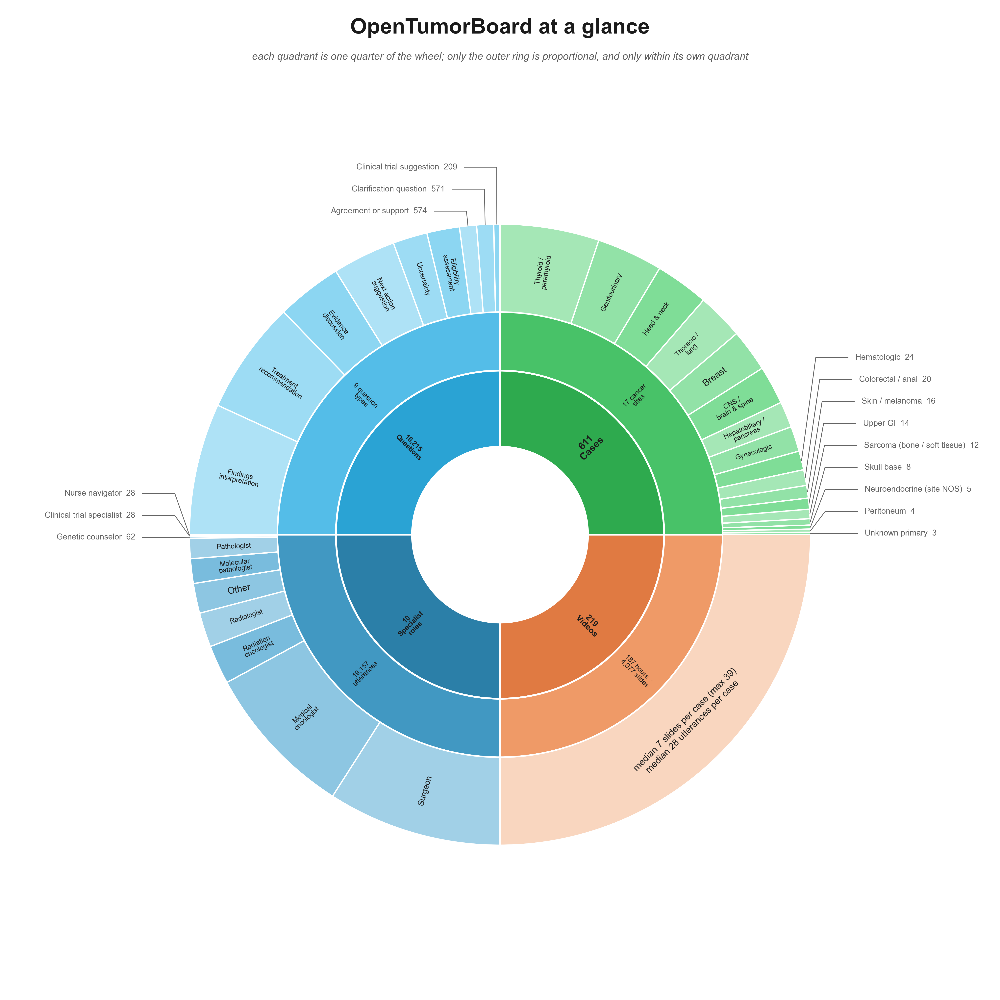
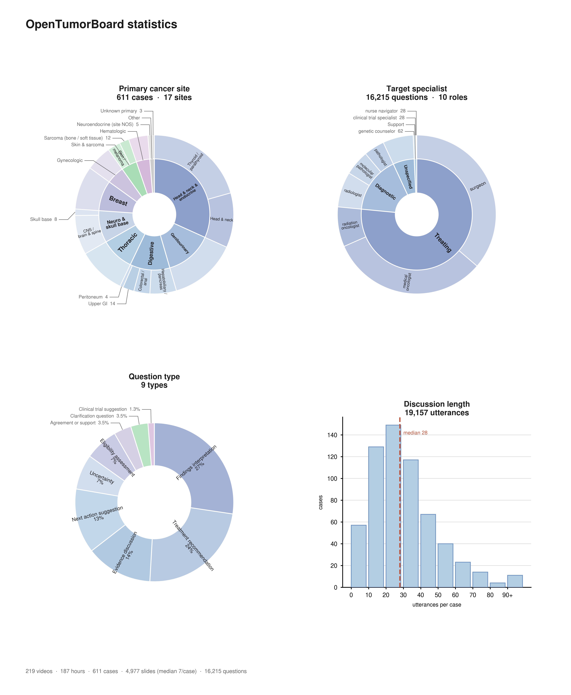
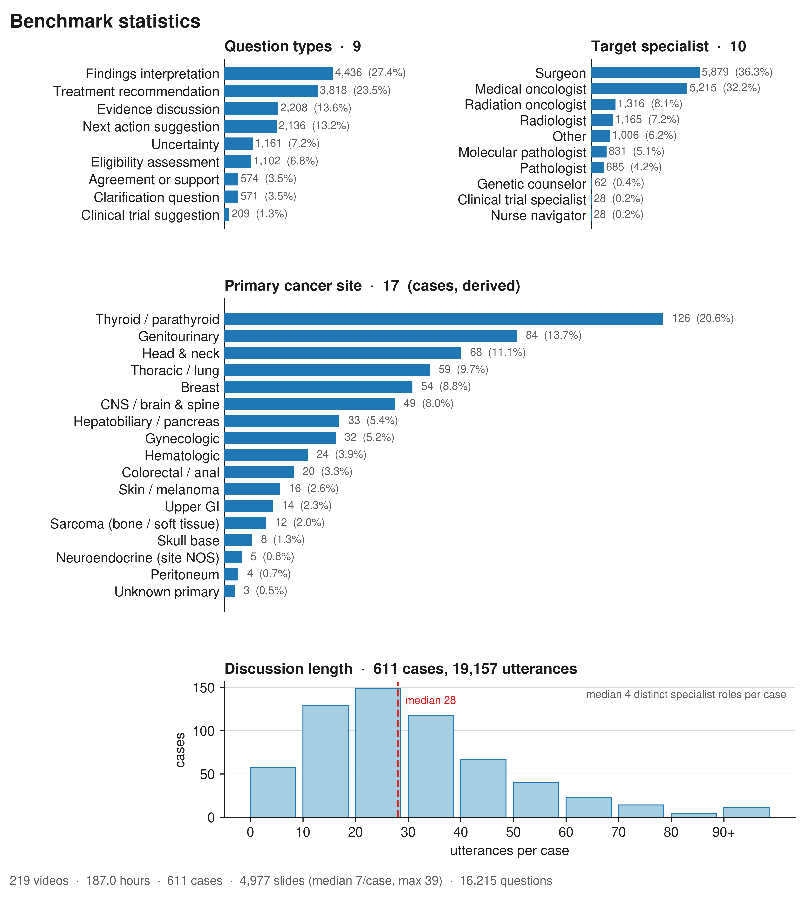
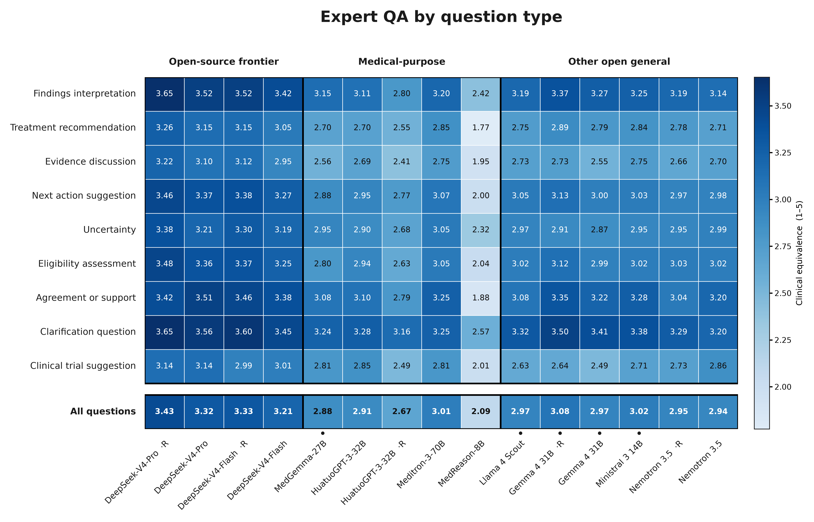
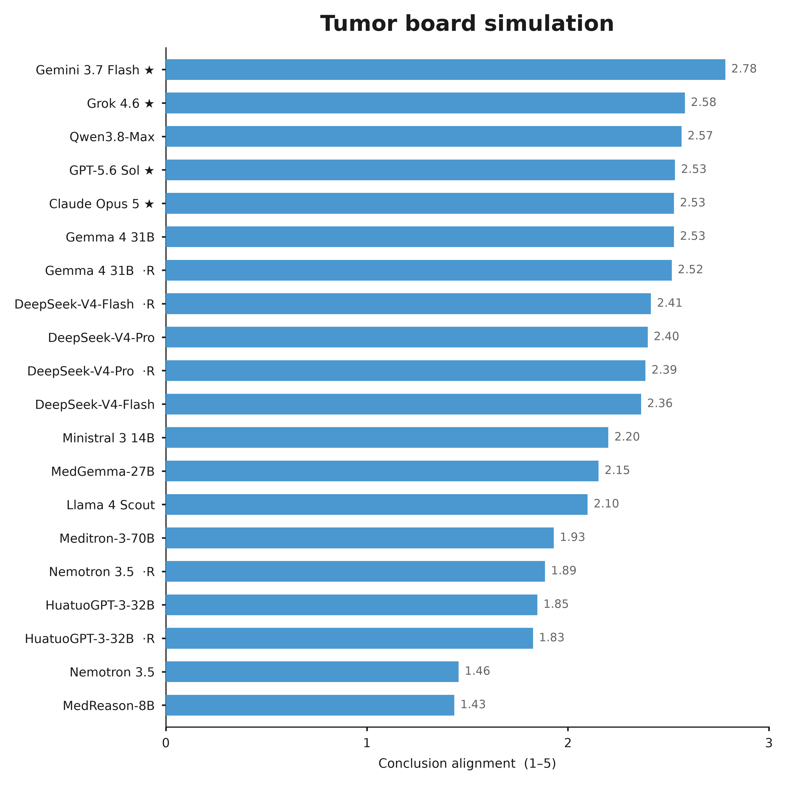
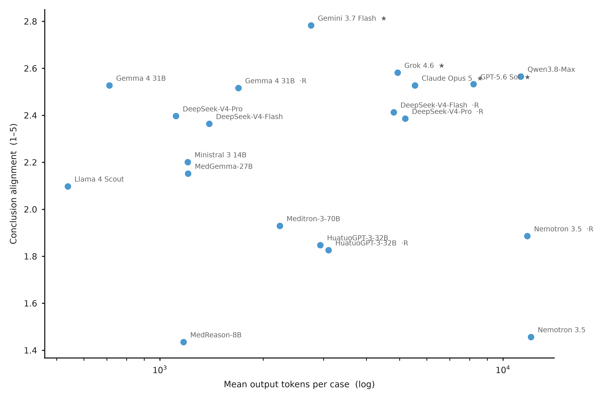
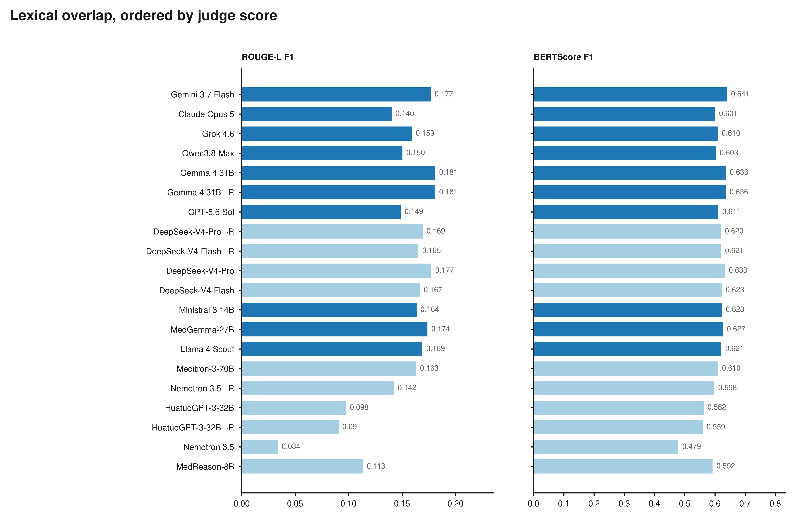

# OpenTumorBoard — paper figures

Figures 1, 2b, 3 and 4 for the OpenTumorBoard benchmark paper, and the code that
produces them. Every number is read from the benchmark's own result catalog at run
time; nothing is typed in.

| | Figure | Script |
|---|---|---|
|  | **Fig 1** benchmark overview | `figure1_overview.py` |
|  | **Fig 2b** the whole benchmark as one wheel | `figure2b_wheel.py` |
|  | **Fig 2b** four nested-ring panels | `figure2b_sunburst.py` |
|  | **Fig 2b** same data as bars | `figure2b_statistics.py` |
|  | **Fig 3** expert QA heatmap (Task 2) | `figure3_task2_heatmap.py` |
|  | **Fig 4a** simulation scores (Task 1) | `figure4_task1_results.py` |
|  | **Fig 4b** tokens vs score | " |
|  | **Fig 4c** ROUGE-L / BERTScore | " |

`figures/` holds pdf, svg and png for each. `provenance/` holds, per figure, the
source SHA-256s, the resolved font, every number drawn, and a caption — the captions
are not optional: Fig 3 in particular carries no legend text on the canvas.

## Quick start

The inputs are committed under `data/` (142 MB), so a clone reproduces every figure
with no access to the source workspace:

    pip install -r requirements.txt

    python -m scripts.paper.figure1_overview      --manifest-dir data/model_evaluation/manifests --output-dir fig1_out
    python -m scripts.paper.figure2b_statistics   --manifest-dir data/model_evaluation/manifests --output-dir fig2b_out
    python -m scripts.paper.figure3_task2_heatmap --workspace data --output-dir fig3_out
    python -m scripts.paper.figure4_task1_results --workspace data --output-dir fig4_out

All four have been run from a clean checkout on the default font and reproduce the
committed figures.

### About `data/`

145 files: the benchmark manifests, the result catalog and model registry, and every
judge / ROUGE / BERTScore / generation-cost summary the catalog lists as active. It is
the benchmark's evaluation record, not the raw corpus — no video, no slide images.

`scripts/collect_inputs.py` is what produced it and refreshes it. **The catalog moves.**
Task 1's published rubric went v25 -> v31 during this work and took the judge batch,
the candidate runs and every auxiliary metric with it, so `data/` is a snapshot. Each
provenance file records the catalog SHA-256 it was built against; re-run the collector
against the live workspace to resync.

One file, `expert_qa_trainval_...jsonl`, is 66 MB. That is under GitHub's 100 MB hard
limit but over its 50 MB warning threshold, so a push prints a warning and succeeds.

---

Four figure scripts, self-contained and portable. Written by `yd68`; the project
workspace belongs to `al318` and is read-only here, so nothing was committed into it.

    scripts/paper/figure1_overview.py       Fig 1   benchmark overview
    scripts/paper/figure2b_statistics.py    Fig 2b  dataset statistics
    scripts/paper/figure3_task2_heatmap.py  Fig 3   expert QA heatmap      (Task 2)
    scripts/paper/figure4_task1_results.py  Fig 4   simulation results     (Task 1)
    scripts/paper/cancer_sites.py           helper, used by Fig 2b only
    scripts/collect_inputs.py               extracts the inputs for a move

---

## Moving to another server

**1. Extract the inputs.** The full workspace is >1 GB, nearly all of it slide images
and raw video the figures never open. This pulls only what the scripts read — about
**148 MB in ~145 files** — keeping relative paths so the copy is a drop-in `--workspace`:

    python scripts/collect_inputs.py \
        --workspace /rhf/allocations/wq8/dhi-rhf/al318/OpenTumorBoard_workspace \
        --dest      ./otb_inputs \
        --tar       otb_inputs.tgz

It resolves the file set from `results_catalog.json` at run time rather than from a
checked-in list. That is not neatness: the catalog moved under this project mid-week
— Task 1's published rubric went v25 → v31, and the judge batch, the candidate runs
and every auxiliary metric moved with it — and a static list would have shipped the
stale set without saying so.

**2. Copy `otb_inputs.tgz` and this directory to the new machine.**

**3. Install.** Python 3.11 and:

    pip install "matplotlib>=3.8" numpy

Verified on Python 3.11.15 / matplotlib 3.10.9 / numpy 2.4.6.

**4. Run.** From this directory, with `W` pointing at the extracted tree:

    W=./otb_inputs

    python -m scripts.paper.figure1_overview      --manifest-dir $W/model_evaluation/manifests --output-dir fig1_out
    python -m scripts.paper.figure2b_statistics   --manifest-dir $W/model_evaluation/manifests --output-dir fig2b_out
    python -m scripts.paper.figure3_task2_heatmap --workspace $W --output-dir fig3_out
    python -m scripts.paper.figure4_task1_results --workspace $W --output-dir fig4_out

All four have been run against a fresh extract on the default font and reproduce.

### Fonts

The published figures use Arial, which is **not** required. Omit `--font-family` and
the scripts use DejaVu Sans, which ships with matplotlib. To match the published look,
copy `model_evaluation/figures/fonts/` from the old workspace and add:

    --font-family Arial --font-dir /path/to/fonts

A named family that is not installed is an error, not a silent substitution: matplotlib
falls back without telling you, and a paper figure must not change typeface quietly.

---

## What each script does

### Fig 1 — overview

Source → shared input → two tasks. The middle column is the point: both tasks receive
the same case summary and slide captions and differ only in what is demanded back.

Every string on the canvas comes from one real case read from the manifests; the
default is `video_cc76d189e9e7967f / case_001` (52-year-old man, high-risk localized
prostate cancer; 8 turns, 6 roles, 13 questions), chosen because its role sequence is
short enough to print in full. Swap it with `--video-uid / --case-id`, and pick a
different question with `--qa-id` or `--qa-index`. The default question is chosen by
heuristic; note that "shortest QA" selects vacuous pairs, so it targets a substantive
answer that still fits two lines.

### Fig 2b — statistics

Three interchangeable versions of the same four distributions:

- `figure2b_wheel.py` — one wheel, four quadrants, for a teaser or a slide
- `figure2b_sunburst.py` — four nested-ring panels
- `figure2b_statistics.py` — horizontal bars

**Reading the wheel.** Each quadrant gets an equal quarter of the circle. The quarters
are *not* proportional to one another and must not be read that way — 611 cases and
16,215 questions are different units, and sizing them against each other would claim a
ratio that does not exist. Proportion is meaningful only along the outer ring, within
one quadrant. The corpus quadrant's outer ring is a single wedge for the same reason:
splitting it would imply a proportion between a slide count and an utterance count.

The sunburst's inner rings **regroup** the published leaf labels; they do not
reclassify anything. Cancer sites roll up to organ system, target roles to what the
specialist does in a board. Verified: the two versions emit byte-identical counts for
all 17 sites, 10 roles, 9 question types and every scale number, so either can be used
and they cannot disagree.

Discussion length stays a histogram in both. It is a distribution over a continuous
variable, and a ring would have to bin it into categories the data does not define.

Four panels: question types, target specialist, primary cancer site, discussion length.

`cancer_sites.py` supplies the site panel. The dataset has **no categorical site
field**, so the label is derived from the free-text `[ diagnosis ]` in two stages:
clauses describing where disease *spread* are removed, then ordered keyword rules run
on the remainder. The stripping is the part that matters — without it the site of
metastasis outranks the site of origin and "small cell lung carcinoma with brain
metastases" is counted as a CNS case; that bug moved 19 cases in the first draft.
Coverage is 611/611 with no `other` bucket, and per-case assignments ship as
`*.cancer_sites.jsonl`.

Limits: keyword mapping, not a clinician's label; ~12 synchronous multiple-primary
cases get a single first-match label; histology-vs-site ties resolve to site.

### Fig 3 — expert QA heatmap (Task 2)

Models on rows, the nine question types on columns, cells the judge's mean clinical
equivalence (1–5) over all 4,844 test questions. Black boxes group the model
categories; colour is spent on the score alone.

The arm's judged key is chosen by its **condition** — a multimodal arm publishes as
`mm_<key>` — because several bare keys still resolve to superseded v3 batches that are
not board rows. The script refuses if any column lands on a protocol other than
task2_judge_v4, which is what caught `gemma4_31b_it` resolving to a v3 batch.

The figure carries no legend text. What it no longer states on the canvas — the metric,
that a blue label means slides + captions, that closed-source models are absent — is in
the `caption` field of the provenance JSON and **must** be used with it.

### Fig 4 — simulation results (Task 1)

Three files: `fig4a_scores` (bars), `fig4b_tokens` (tokens vs score), `fig4c_lexical`
(ROUGE-L and BERTScore, appendix).

**The bars are two groups, not one league table.** Seven arms answer from the slide
images; ten are text-only and answer from captions alone, which the catalog files as
`ablation_caption_only` — the reduced half of Task 1. Since 2026-08-30 the two groups
also run different *output contracts* (`multimodal_v3` vs `transcript_captiononly_v1`),
which makes a single ranking worse still.

**The score is `dimensions_all_responses`, not `dimensions`** — the leaderboard's own
convention, per `server/benchmark_results.py`: cases the arm never concluded enter at
the rubric floor of 1, so it is graded on every case it was given rather than on the
ones it chose to answer. It moves one arm materially (`medreason_8b`), and that arm is
the reason the rule exists.

**There is no cost panel.** Every run is local vLLM against open weights and nothing
carries a price; the generation-cost report declares `cost_axis: output_tokens.mean`.
A cost plot would be the token plot with a relabelled axis. A real cost axis needs the
API arms that do not exist yet.

---

## How the scripts behave

They refuse rather than guess. A missing font, a missing record, a QA that does not
belong to the case drawn beside it, text that would overflow its own box, a column
resolving to the wrong judge protocol, or an auxiliary metric computed over a
superseded run all stop the build. Two of these caught real defects during
development; the auxiliary-metric check exists because the 2026-08-30 regeneration
would otherwise have paired new scores with old responses, which no panel would show.

Fig 3 and Fig 4 resolve their numbers through `results_catalog.json` under the
catalog's own last-one-wins rule rather than by naming a batch directory. Do not
hardcode a batch: this figure set already pointed at v25 a week after v25 left
`aggregate_sources`.

Every run writes a `*.provenance.json` beside the outputs recording source SHA-256s,
the resolved font file, every number drawn, and a caption.

---

## Known gaps, all four figures

- **No closed-source models anywhere.** The registry holds only open-weight vendors,
  so Fig 3's closed block and Fig 4's are empty. Fig 4 additionally lacks Kimi3,
  Muse Spark 1.2 and Qwen3.8 max.
- **Fig 3's numbers cover all 4,844 questions**, not the annotator-accepted subset the
  plan calls for as the primary benchmark. The Study A ratings are not in this
  workspace; if they land and filter the set, every Fig 3 number changes.
- **Task 1 under v31 has no `difference_rates`**, so the optional Fig 7 error-mode
  heatmap cannot be built from the published batch. Only the retired v25 carried it.
- **The Task 2 judge is Qwen3.6-27B while Qwen3.8-27B is a candidate.** Same family,
  and it takes the top Task 2 score by 0.03. Worth a sensitivity check or a caveat.
